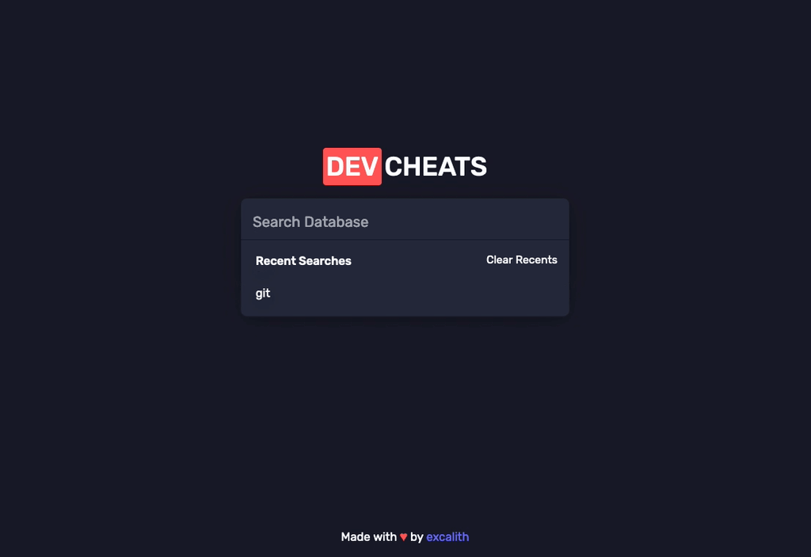

	<h1 align="center">Dev Cheats • Interactive Cheatsheet</h1>

Dev Cheats is a community-driven, intuitive and user-friendly interactive cheatsheet that provides a handy reference for developers to search and access various command line tool usages quickly and efficiently.

    

## Features

With Dev Cheats you can;

- Easily search for commands by name
- Filter a group of commands by category
- Copy usage examples to paste into your terminal
- If available, click any command name to launch the original documentation
- Show and hide commands depending on their complexity through the menu
  
Also includes local storage to remember your preferences next time you launch the app. Nothing is stored on the server!

## Demo

You can find and bookmark the online version from [dev-cheats.vercel.app](https://dev-cheats.vercel.app)

## How To Contribute

You can hop into [discussions](https://github.com/excalith/dev-cheats/discussions) to discuss any ideas or suggestions you have. Feel free to contribute any way you can. Just keep in mind that you should pay attention to [contributing guideline](.github/CONTRIBUTING.md).

## License

This project is licensed under the MIT License - see the [license file](LICENSE) for details.
